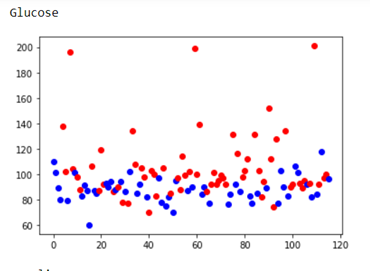
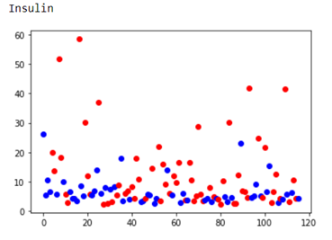
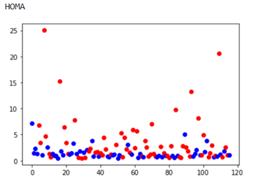
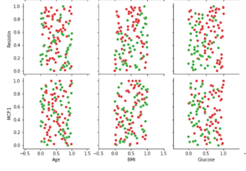
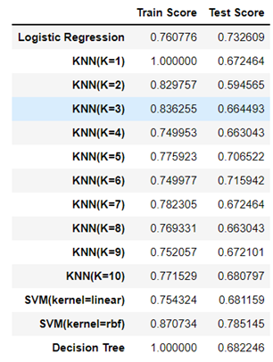

Poject Overview

Analysis of Plots

1. Single Feature Plots

Each feature has been plotted with data points colored according to their class. One of the more distinguishable plots is the glucose plot, which is an important indicator in medical diagnosis of tumors. In addition to glucose, insulin is also noteworthy. Insulin is a natural hormone that lowers blood sugar, and naturally, as blood sugar increases, the need for insulin rises. The two-feature plot of glucose and insulin clearly shows a direct relationship between these two parameters.
The HOMA (Homeostatic Model Assessment) feature helps evaluate the function of pancreatic beta cells and overall insulin resistance. As observed, some cancer patients score higher on this feature compared to non-cancer individuals, indicating higher insulin resistance among the former. In medical terms, an increase in blood sugar levels and insulin resistance are signs of cancer progression.

  

2. Two-Feature Plots

In the two-feature plots, the ones with glucose or related parameters on one axis are more distinguishable. However, due to the presence of outliers, the separability was not very noticeable using standard scaling. Therefore, I used quantile transformation for preprocessing the data, which has made classification somewhat easier, as demonstrated in the notebook.
One feature potentially significant in cancer is a protein called resistin, which is normally secreted by fat cells and increases under inflammatory conditions. The plot of this feature with glucose is shown. Additionally, the relationship between the MCP1 gene and glucose is noticeable, and these features could be linearly separable.

3. Results

Based on model accuracy, the SVM model with the RBF kernel function appears to perform the best for classification. The performance of other models is summarized in the table below:

