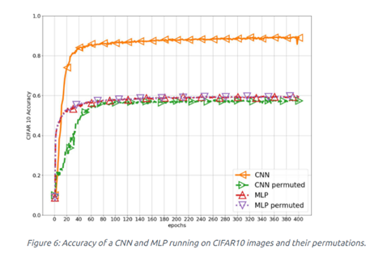
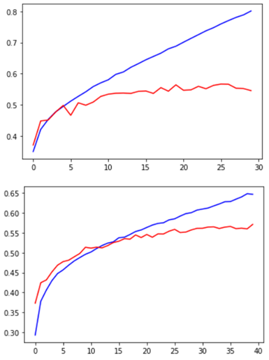
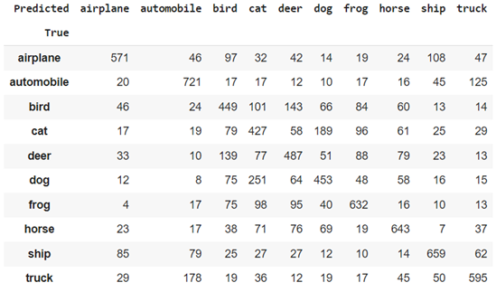

# Project Overview

**Author:** Faraz Sarmeili  
**Contact:** Sarmeili.f@gmail.com  

## Preprocessing Stage
In the preprocessing stage, the input to the MLP (Multi-Layer Perceptron) should be a list of features. Therefore, we initially reshape all images into vectors. Each image is represented as a 32x32x3 tensor (the 3 indicates color channels), and all arrays are converted into 3072-element vectors. Since each pixel value ranges from 0 to 255, we normalize the data by dividing all pixel values by 255.

Data augmentation has been shown to improve model performance, especially for CNN models. As illustrated in the following plots, data augmentation improved model accuracy by about 5%. Another important consideration for MLPs is addressing the position invariance issue. Besides data augmentation, another effective solution is reducing the image size using OpenCV. This approach was found to increase accuracy by about 3% on a subset of the dataset.

## Model Training and Evaluation
1. **Cross-Validation and Static Training:**
   - **5-Fold Cross-Validation:** Trained the model on one-fifth of the data and evaluated it on the test set. Accuracy was 43%.
   - **Static Training:** Trained the model on one-fifth of the data without cross-validation. Accuracy was 44%.
   - Conclusion: Cross-validation did not significantly improve accuracy, so it may be avoided for faster training, except during hyperparameter tuning.

2. **Single-Layer Model:**
   - **Number of Neurons:**
     - 500 neurons: 47% accuracy
     - 700 neurons: 47% accuracy
     - 10,000 neurons: 48% accuracy
     - 200 neurons: 44% accuracy
   - **Activation Functions:**
     - ReLU (500 neurons): 47% accuracy
     - Sigmoid (first layer): 45% accuracy
     - Sigmoid (second layer): 47% accuracy
     - Tanh (first layer): 47.5% accuracy
     - Softmax (both layers): 25% accuracy
     - ELU (first layer): 45% accuracy
     - SELU (first layer): 44% accuracy
   - **Optimizers:**
     - Adam (learning rate 0.0001): 47% accuracy
     - SGD: 39.5% accuracy
     - RMSprop: 41% accuracy
     - Adagrad: 40% accuracy
     - Adam (learning rate 0.001): 41% accuracy
     - Adam (learning rate 0.01): 16% accuracy
     - Adam (learning rate 0.00001): 43% accuracy
   - **Number of Layers:**
     - Two layers (500 neurons each): 47.5% accuracy
     - Two layers (1000 neurons each): 48.8% accuracy
     - Three layers (500 neurons each): 49.9% accuracy, with some overfitting
     - Four layers (500 neurons each): 48.5% accuracy
     - Various combinations: Best result with three layers (700, 500, 300 neurons): 48% accuracy

3. **Epochs and Batch Size:**
   - 30 epochs, batch size 20: 48.5% accuracy
   - 50 epochs: No improvement, more overfitting
   - 20 epochs: 46% accuracy
   - Batch size adjustments (30, 45, 50): Best result with batch size 45: 48.7% accuracy

## Results and Observations
- The maximum accuracy achieved by MLP models is around 55%, which is consistent with literature that suggests MLP models typically achieve below 60% accuracy. CNN models generally perform better (see [DeepAI publication](https://deepai.org/publication/convolutional-neural-networks-on-randomized-data)).
- Regularization techniques such as dropout were used to mitigate overfitting. The model achieved 55% accuracy on the entire dataset, but without regularization, there was a risk of overfitting.

 

## Confusion Matrix
The confusion matrix for this model is provided below:

## Conclusion
The MLP model achieved a maximum accuracy of 55% with regularization to prevent overfitting. The findings align with existing research, indicating that CNN models generally offer higher accuracy for image classification tasks.

For further information or questions, please contact Faraz Sarmeili at Sarmeili.f@gmail.com.