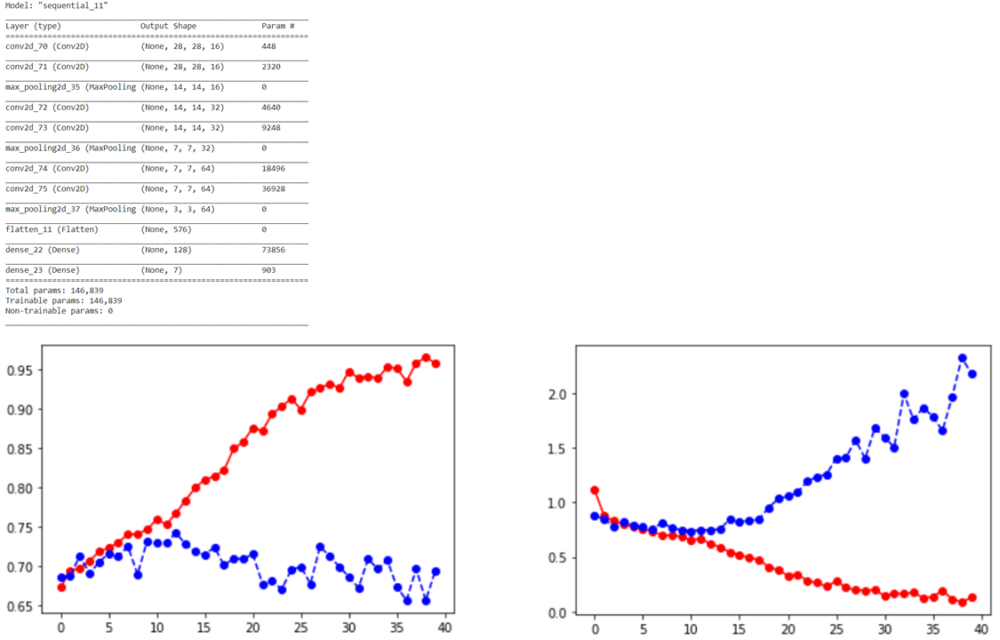
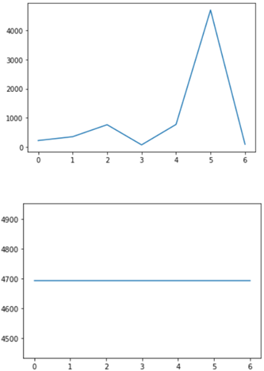
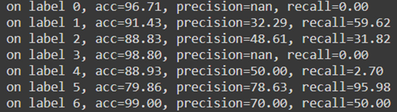
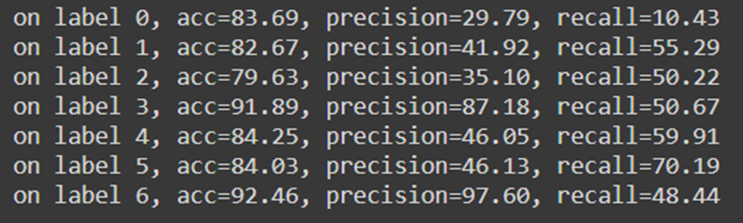
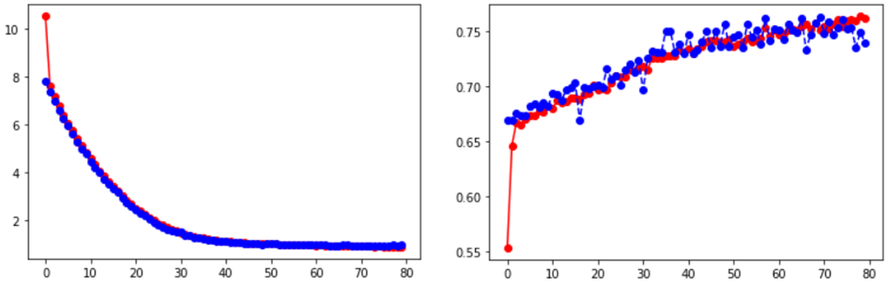

# Project Overview

**Author:** Faraz Sarmeili  
**Contact:** Sarmeili.f@gmail.com

## Model Training and Evaluation

### Initial Model (VGG-like)
To establish a baseline, we built a VGG-like model without any regularization or preprocessing and trained it on the training data. The VGG model typically accepts larger input images than 28x28 pixels. Using 28x28 images would result in dimension issues in the final layers of the VGG model. Therefore, a modified VGG-like model was used. The initial model used the Adam optimizer with a default learning rate of 0.001. The training plots below indicate significant overfitting, with an accuracy of 69.5% on the test data.

### Preprocessing
1. **Normalization:** 
   - Normalizing pixel values by dividing by 255 scaled the pixel values between 0 and 1. This improved the model's performance slightly, increasing accuracy to approximately 72%.
   - **Data Augmentation:** Implementing data augmentation reduced overfitting, but accuracy dropped to 67%.
   
2. **Resampling:** 
   - **Class Imbalance:** The dataset is imbalanced. We addressed this with resampling techniques. The frequency distribution of labels before and after oversampling is shown below.
   - **Oversampling and Data Augmentation:** This combination slightly reduced overfitting but lowered accuracy to 63%. Training the model solely with random oversampling led to significant overfitting. Using random undersampling with data augmentation didn't train the model effectively due to the small dataset size.
   

3. **Image Resizing:**
   - **Using VGG16:** Resizing images to 224x224 and training a VGG16 model resulted in similar overfitting and lower accuracy (66%). Despite long training times, the VGG16 model did not perform better in terms of accuracy or overfitting.
   - **Regularization:** Using dropout and L2 regularization (0.01) significantly reduced overfitting. Changing the learning rate to 0.0001 and applying L2 regularization and dropout to each block improved accuracy to 75%.

### Hyperparameter Tuning
1. **Layers and Neurons:**
   - Adjusting the number of layers and neurons did not significantly affect performance, with a three-layer configuration yielding the best results.

2. **Activation Functions:**
   - **ReLU:** Best performance
   - **Tanh:** Similar performance but longer training time
   - **Sigmoid:** Model failed to train
   - **SELU:** Improved accuracy and performance

3. **Kernel Size:**
   - Changing kernel sizes (3x3 to 5x5 or 7x7) did not significantly improve accuracy. Larger kernels led to more overfitting.
   - Adjusting the max pooling kernel from 2x2 to 3x3 slightly improved accuracy.

4. **Pooling Methods:**
   - **Max Pooling:** Better performance
   - **Average Pooling:** Reduced accuracy

## Confusion Matrix
The confusion matrix provided here is based on the validation data. As previously mentioned, this dataset is imbalanced. It is evident that the class with more data has better accuracy compared to other classes. The model struggles significantly to predict two classes due to the very small data volume.

To address this issue, we can use the random oversampling method to balance the data somewhat. Below is the confusion matrix from the model trained on the oversampled dataset. Although the overall accuracy might be lower, the performance of the model on individual classes, calculated using other metrics, has improved significantly compared to the previous model. Note that data augmentation was also performed on the oversampled data to reduce overfitting.

### Before Oversampling:

### After Oversampling:

### Conclusion
The model achieved a maximum accuracy of 75% with appropriate regularization. This aligns with benchmarks for this dataset (see [MedMNIST](https://medmnist.com/)). Overfitting was addressed with dropout and L2 regularization. The model's performance is also likely affected by the class imbalance in the dataset.

To ensure accurate performance evaluation, we used random oversampling with the final model, achieving 68% accuracy on the test set. This accuracy is more reflective of the model's real-world performance, despite some overfitting due to oversampling.

For further information or questions, please contact Faraz Sarmeili at Sarmeili.f@gmail.com.