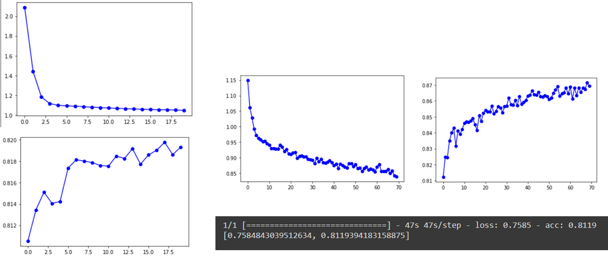
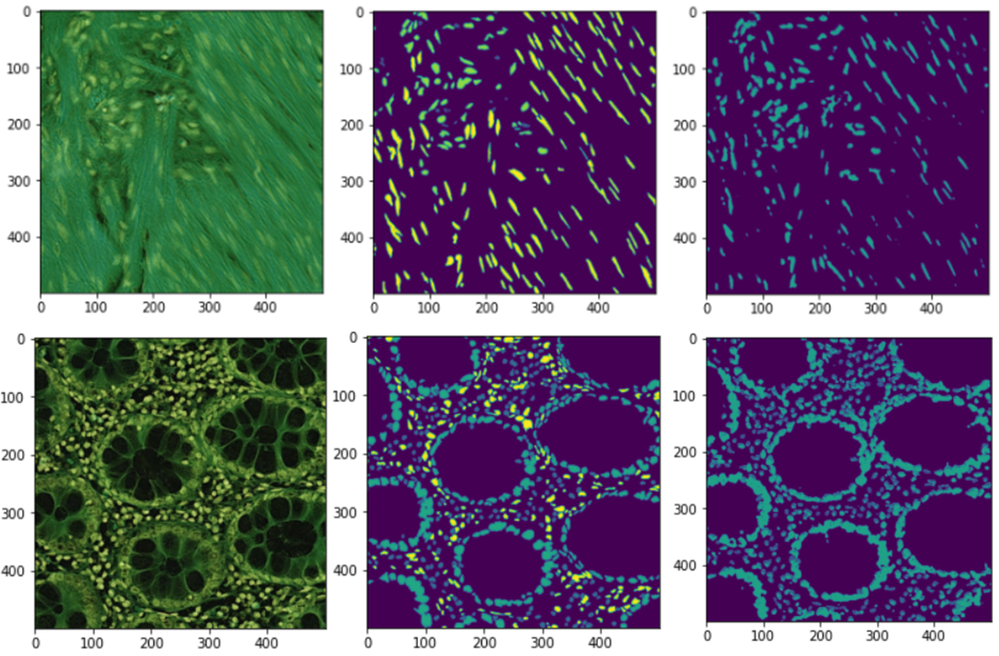
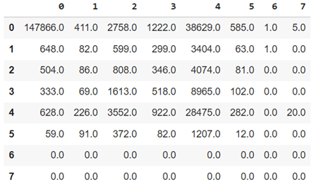
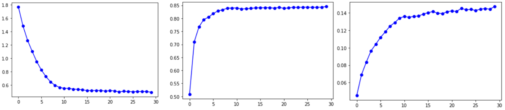
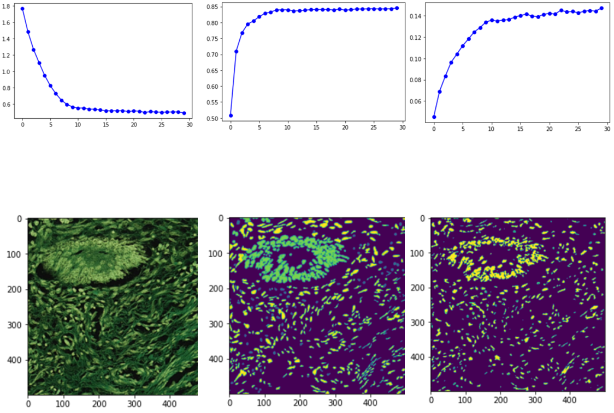
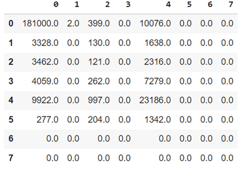
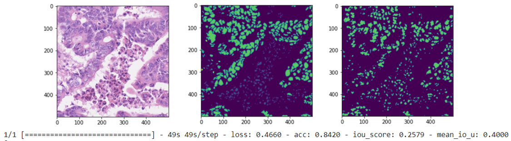

## Histopathological Image Analysis

As we know, histopathological images obtained using Hematoxylin and Eosin (H&E) staining are among the most critical images used in diagnosing cellular pathologies. The way these chemical stains spread is such that one binds to the cell membrane, which contains more fat, and the other binds to the genetic material concentrated in the cell nucleus. The complexes formed by these chemical compounds cause these two areas to appear in different colors under the microscope. From these images, which are obtained by sampling a specific tissue from the patient in the laboratory, doctors can diagnose the type of cell and the likelihood of cancer or other tissue-specific diseases by examining the shape of the nucleus, the cell, and their location and number.

### Dataset
The dataset used in this project includes various labels, one of which is more comprehensive and involves identifying the exact location of nuclei and the type of cell based on the shape of the nucleus. For this exercise, we have used this label.

### Data Augmentation
Data augmentation using Keras and the `ImageDataGenerator` class may not be effective here. In segmentation tasks, we need the labels, which are also images, to change along with the input data. This task might be challenging with `ImageDataGenerator`, so another library like `imgaug` is usually recommended. However, I chose to perform this task without augmentation initially and to use augmentation if there are issues with model training or overfitting.

Given the sensitivity of this task and the fine details that may exist in the images, it is crucial to note that the shape of the nucleus and cell morphology are highly significant. Thus, we should avoid overall image shearing or stretching. Additionally, since colors are essential in this task, we must ensure that no color from the image boundaries gets transferred to the edges when shifting the image.

### Model and Transfer Learning
Due to an error I made in coding transfer learning and suspecting issues with the models I downloaded or the libraries I used, the number of models and libraries in my program is somewhat large. However, using titles, the code sections have been hidden to prevent disorganization. The primary model is the first one, which was used in a Kaggle competition for identifying lunar rocks, and I applied transfer learning from that model due to the similarity in segmentation outlines.

Initially, I added another convolutional layer to the end of the model and trained only the last layer. The loss and accuracy graphs are shown below. Then, I fine-tuned the entire model and tested the final accuracy on the test dataset. Note that the metric here is pixel accuracy, and all graphs and final accuracy are provided below.

### Evaluation Metrics
Although we might assume that good accuracy indicates good model performance, we must verify this using other evaluation criteria. Therefore, I retrained the model and used IoU and MeanIoU metrics this time. While MeanIoU did not change much during training, IoU showed an increasing trend, though its value was not very significant. To better understand the model's performance, we compare the original image, the label, and the predicted label below (the first row is one of the test dataset images, and the second row is from training).

As seen, the model may have performed well in detecting positions but not so well in classifying classes. To gain better insight, we use the confusion matrix on the test dataset, which shows that some classes, like classes 6 and 7, do not perform well, likely due to a lack of data. Hence, we turn to data augmentation.

### Data Augmentation for Segmentation
As mentioned, for this segmentation project, we cannot easily use Keras for preprocessing, so we use another library specific to this task. The updated model information after augmentation is provided below. This time, the model did not perform poorly across different classes, and the output images show that the classes are somewhat detected, albeit not very accurately.

### Confusion Matrix
Despite the improvements, the confusion matrix shows that the model still has significant issues in detecting less populous classes. To address this dataset imbalance, as suggested in the dataset's website, we combine classes 3 and 4 into epithelial cells and classes 5, 6, and 7 into spindle-shaped cells to improve model performance.

With this method, the accuracy and model performance on the test dataset are significantly better than in previous cases, providing satisfactory results on our validation dataset.

